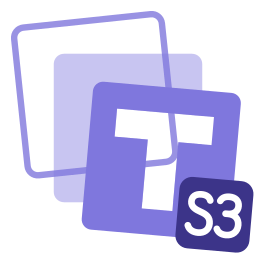

<div align="center">



# TessariDB S3

**Object storage that speaks S3, with its metadata in TessariDB.**

A clustered, S3-compatible object store written in Rust. Objects live on the
storage nodes' drives; every bucket, key, version, upload and policy lives in a
TessariDB cluster.

[](#status)
[](LICENSE)
[](#building)

[tessaridb.com](https://tessaridb.com) · [TessariDB](https://github.com/tessaridb/tessaridb) ·
[docs](https://docs.tessaridb.com)

</div>

> [!NOTE]
> **It stores nothing yet.** The server starts, verifies SigV4 signatures and
> resolves every request to one of the 116 S3 operations, then answers each of
> them `NotImplemented`. There is no release and no image. Apart from the
> [Status](#status) section and the items marked as tested below, this page
> describes what the project is for, not a working system.

## What it is for

Unmodified S3 clients — the AWS SDKs, the AWS CLI, `rclone`, backup tools — talk
to it as they would talk to S3. Behind the API it runs as a cluster:

- **Metadata in TessariDB.** Buckets, object versions, multipart uploads, bucket
  policies and cluster membership are records in a TessariDB cluster. The listing
  order, conditional writes and the commit of an object's metadata are that
  database's transactions and indexes, not a second store kept beside it.
- **Data on the storage nodes.** Object bytes are spread across the nodes' drives
  under a stated redundancy rule, and a write is acknowledged only once it is
  durable on its write quorum.
- **One Rust codebase.** Asynchronous I/O on a multi-threaded runtime, with typed
  protocol values from the request parser to the disk.

## The promises it is being designed to keep

These are design commitments. Each will be backed by a test before any release
claims it; the two marked **tested** already are:

- **An operation it does not implement is refused** with `NotImplemented`. It is
  never routed to a neighbouring operation. **Tested:** each of the 116
  operations of the AWS S3 model is signed, sent, and answered `NotImplemented`,
  and an unknown or misplaced parameter is refused before any operation runs.
- **Every signature and every declared checksum is verified.** That covers SigV4
  header, presigned and streaming authentication, and Content-MD5 and the
  `x-amz-checksum-*` family, before a write is acknowledged. Each checksum is
  stored so that a read can return it. **Tested for SigV4:** header, presigned
  and streaming signatures reproduce AWS's published examples, and each example
  altered in one place is refused. The checksum half comes with the object core.
- **Strong read-after-write**, for listings too, with keys listed in byte-wise
  UTF-8 order and continuation tokens that neither skip nor repeat a key.
- **A write is acknowledged only when it is durable** on its quorum, with its data
  and its metadata committed together.
- **Object Lock is enforced wherever data can be deleted**, including lifecycle,
  healing, rebalancing and administration, not only in the API handler.
- **Compatibility is a published matrix**, one row per S3 operation, each marked
  implemented or refused. It is not a claim.

## Status

| | |
|---|---|
| Stage | pre-alpha |
| Server | authenticates SigV4 and answers every S3 operation `NotImplemented`; stores nothing |
| Releases | none |
| Licence | BUSL-1.1 (see [Licence](#licence)) |

## Building

A Cargo workspace on Rust 1.98 (edition 2024). It builds one process, `tessaridb-s3`.

```sh
cargo build --workspace
cargo fmt --all --check
cargo lint        # clippy on every target and feature, warnings denied
cargo t           # every library and integration test
cargo deny check
```

## Running

The process reads its configuration from the environment:

| Variable | Default | Meaning |
|---|---|---|
| `TESSARIDB_S3_ROOT_ACCESS_KEY` | — (required) | the root credential's access key |
| `TESSARIDB_S3_ROOT_SECRET_KEY` | — (required, ≥ 16 bytes) | the root credential's secret |
| `TESSARIDB_S3_LISTEN` | `127.0.0.1:9100` | the address the S3 API listens on |
| `TESSARIDB_S3_REGION` | `us-east-1` | the region requests must be signed for |
| `TESSARIDB_S3_DOMAINS` | empty | comma-separated endpoint domains for `<bucket>.<domain>` addressing; path-style always works |
| `TESSARIDB_S3_MAX_INFLIGHT` | `1024` | requests served at once before new ones get `503 SlowDown` |
| `TESSARIDB_S3_SHUTDOWN_GRACE_SECS` | `30` | how long in-flight requests get after SIGTERM |

Anonymous requests are refused. SIGINT or SIGTERM stops the server after the
grace period.

## Branches

`dev` is where development happens. `main` will carry releases and move only by
merging `dev` at a release, with each release tagged there.

## Licence

TessariDB S3 is licensed under the [Business Source License 1.1](LICENSE).
Production use is free, including use by and within a commercial company. Two
things need a commercial licence from the Licensor:
- providing TessariDB S3 to third parties as an object storage service;
- selling, reselling, renting or sublicensing it.

On the Change Date in [`LICENSE`](LICENSE) the code converts to the Apache
License, Version 2.0. For other arrangements, write to licensing@tessaridb.com.
